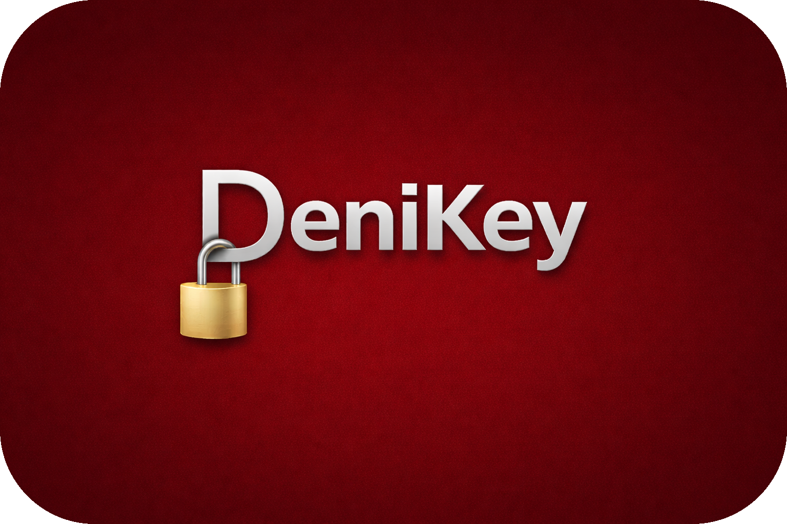

<p align="center">
  
</p>

<h1 align="center">DeniKey</h1>
<p align="center">Zero-knowledge mimarisiyle çalışan bir şifre yöneticisi</p>

<p align="center">
  
  
  
  
</p>

---

DeniKey'i yaparken kendime şu soruyu sordum: *"Bir şifre yöneticisine güvenmek için onun sunucusuna güvenmek zorunda mıyım?"* Cevabım hayırdı. Bu yüzden DeniKey'i sıfırdan zero-knowledge prensibiyle tasarladım — sunucu hiçbir zaman şifrelerinizi göremez, çünkü şifreleme tamamen sizin cihazınızda gerçekleşiyor.

## Nasıl Çalışır?

Bir şifre kaydettiğinizde DeniKey onu doğrudan **AES-256-GCM** ile şifreler ve sunucuya yalnızca şifreli veriyi gönderir. Sunucu bu veriyi açamaz çünkü anahtarı hiç görmez — anahtar, yalnızca sizin master password'ünüzden **Argon2id** ile türetilir ve cihazınızdan hiç çıkmaz.

Giriş yaparken bile master password sunucuya gitmiyor. Bunun yerine istemci yerel olarak bir *auth verifier* türetip yalnızca onu gönderiyor; sunucu `SHA256(verifier)` saklıyor. Yani aktif bir saldırgan sunucuyu ele geçirse bile vault'unuzu açamaz.

## Özellikler

- **Zero-knowledge encryption** — AES-256-GCM + Argon2id, tüm şifreleme client-side
- **İki faktörlü doğrulama** — TOTP desteği, ayarlanabilir trust süresi (12 saat / 1-60 gün)
- **Biometrik kilit** — Android'de parmak izi ile hızlı açma
- **Cihaz yönetimi** — Yeni cihazlar e-posta doğrulamasıyla onaylanır, uzaktan iptal edilebilir
- **Audit log** — Hesabınızda gerçekleşen her işlemin kaydı
- **Çöp kutusu** — Silinen öğeler 30 gün sonra otomatik kalıcı olarak silinir
- **Şifre üretici** — Uzunluk ve karakter seti özelleştirilebilir
- **Çoklu dil** — Türkçe, İngilizce, Rusça

## Güvenlik Mimarisi

```
Master Password
      │
      ▼
  Argon2id (t=3, m=64MB, p=2)
      │
      ├──► Encryption Key  ──► AES-256-GCM ──► Şifreli vault verisi
      │
      └──► Auth Salt  ──► Auth Verifier  ──► Sunucuya gönderilir
                                               (SHA256'sı saklanır)
```

Sunucu yalnızca şifreli veriyi ve `SHA256(verifier)` değerini tutar. Master password ne düz metin ne de hash olarak sunucuya hiç gitmez.

Tüm güvenlik kararları belgelenmiştir. 5 tur kapsamlı statik kod taraması yapılmış, bulunan her açık kapatılmıştır.

## Teknoloji Stack

| Katman | Teknoloji |
|--------|-----------|
| Mobil & Masaüstü | Flutter 3 + Riverpod + GoRouter |
| Şifreleme | AES-256-GCM + Argon2id (`cryptography` paketi) |
| Backend | FastAPI + PostgreSQL + SQLAlchemy async |
| Kimlik doğrulama | JWT (HS256) + TOTP + cihaz doğrulama |
| Deployment | Fly.dev (Frankfurt) + GitHub Actions CI/CD |
| Güvenli depolama | Android Keystore / Ubuntu libsecret |

## İndir

| Platform | İndirme |
|----------|---------|
| Android | [DeniKey-Android.apk](https://github.com/Denisergocmen924/denikey-releases/releases/latest/download/DeniKey-Android.apk) |
| Ubuntu | [DeniKey-Linux.deb](https://github.com/Denisergocmen924/denikey-releases/releases/latest/download/DeniKey-Linux.deb) |

Ubuntu kurulumu: `.deb` dosyasını indirip çift tıklayın, Ubuntu Yazılım Merkezi gerisini halleder.

## Ekran Görüntüleri

*Yakında eklenecek.*

## Lisans

Kaynak kod inceleme amaçlı herkese açıktır. Telif hakkı saklıdır — izinsiz kullanım, dağıtım veya türev çalışma oluşturma yasaktır.
